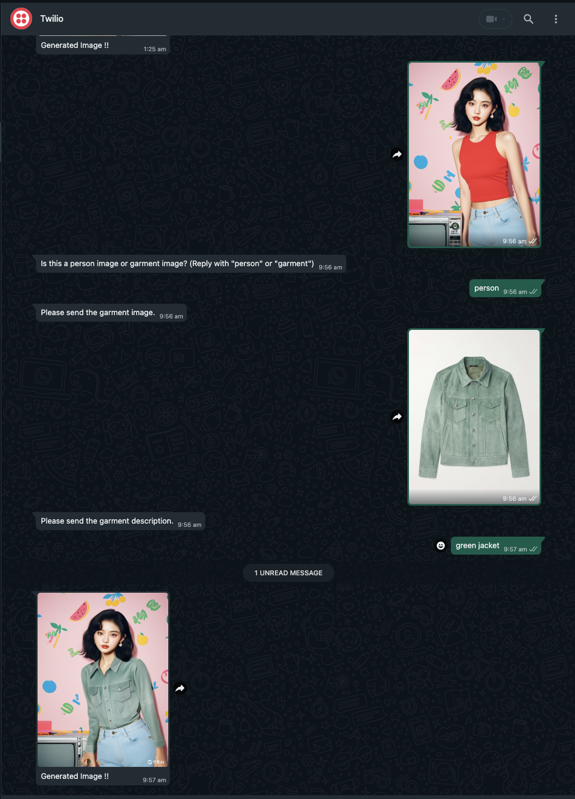
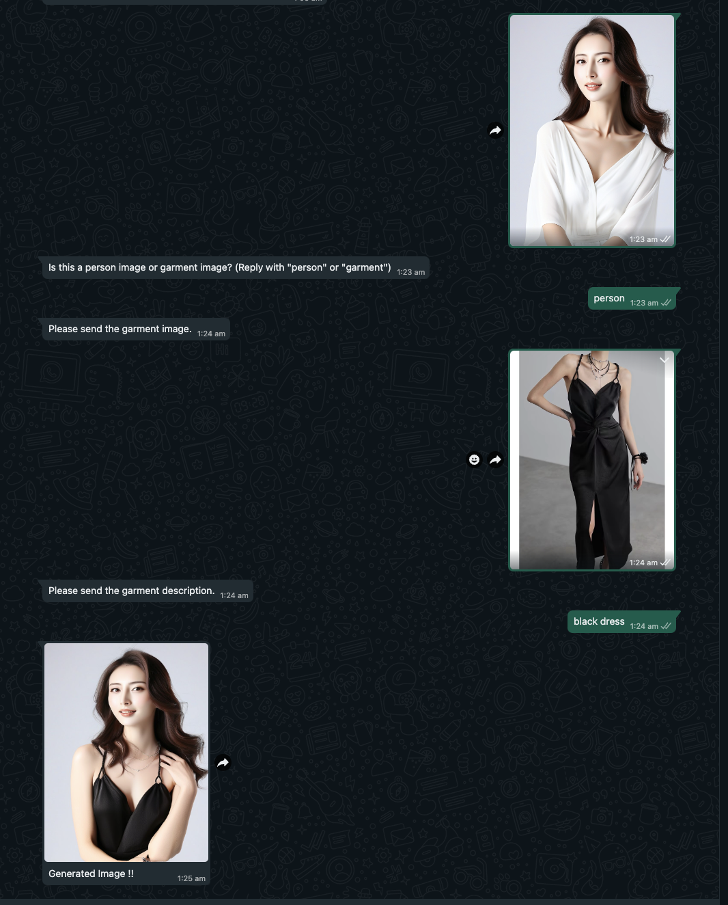

# Virtual Try-On System

This project implements a **Virtual Try-On System** using **FastAPI**, **Hugging Face Spaces**, and **Twilio**. Users can upload images of a person and a garment to generate a try-on image, using an AI-based model for garment fitting. The app integrates with the **Hugging Face API** for try-on image generation and Twilio for messaging services.

## Sample Output

Here are some sample outputs generated by the try-on system:

<div style="display: flex; justify-content: space-around;">
  
  
</div>

## Important Note

This project uses the free versions of Hugging Face APIs, and as a result, the backend is not hosted on any GPU. Occasionally, you may encounter errors related to GPU resource limits. However, if you try again after a short while, the service should work as expected. We appreciate your understanding and patience.

## Features

- **Image Upload and Processing**: Upload images of a person and a garment, along with a garment description. The system uses a pre-trained model to generate a virtual try-on output.
- **Integration with Hugging Face API**: Connects to a Hugging Face Space for generating try-on images using AI.
- **Twilio Integration**: Receives images and text messages via WhatsApp using Twilio's API.
- **File Management**: Automatically deletes old images after 1 hour to conserve storage.
- **Logging and Error Handling**: Comprehensive logging and error management for robust performance.
- **Real-time Feedback**: Provides real-time status messages via the FastAPI and Twilio WhatsApp integration.

## Project Structure

```plaintext

├── main.py               # FastAPI entry point
├── file-utils.py         # Utility functions for file management
├── tryon_service.py      # Try-on processing logic using Hugging Face API
├── twilio_service.py     # Handles WhatsApp message processing via Twilio
├── upload.py             # Handles file uploads and storage
├── templates/            # HTML templates for the frontend
└── static/               # Static files like CSS and images
├── Dockerfile                # Docker configuration
├── requirements.txt          # Python dependencies
└── README.md                 # Project documentation
```

## Installation and Setup
### Prerequisites
- Python 3.8+
- Docker (optional, for containerized deployment)
- Hugging Face API Key
- Twilio Account and API Key

## Step-by-Step Guide

1. **Clone the Repository:**
   ```bash
   git clone https://github.com/travi0764/tryon-webapp.git
   cd virtual-tryon-system

2. **Install Dependencies**: Install the required Python libraries:
   ```bash
   pip install -r requirements.txt

3. **Set Up Environment Variables:** Create a .env file in the root directory and configure your API keys and settings:
   ```bash
    HUGGING_FACE_API_URL=your-hugging-face-api-url
    TWILIO_ACCOUNT_SID=your-twilio-account-sid
    TWILIO_AUTH_TOKEN=your-twilio-auth-token
    AWS_ACESS_KEY=aws-access-key
    AWS_SECRET_KEY=aws-secret-key
    AWS_BUCKET_NAME=bucket-name-to-store-images

4. **Run the FastAPI Server:** Start the server locally:
   ```bash
   uvicorn app.main:app --reload

5. **Use Docker for Containerized Deployment:** Build and run the application in Docker:
   ```bash
    docker build -t virtual-tryon .
    docker run -p 8000:8000 virtual-tryon

## API Endpoints

- `POST /tryon`: Upload images and garment description to generate a try-on image.
- `POST /upload`: Upload images for processing.
- `POST /twilio`: Webhook for receiving messages from Twilio WhatsApp.

## Usage
### Join my Twilio Sandbox 

1. Use whatsapp to send a message to `+14155238886`
2. Use code `join provide-quite`
   
### Virtual Try-On
1. Upload a person image and a garment image.
2. Provide a garment description.
3. The system will generate a try-on image and return it.
   
### Twilio Messaging Integration
Users can send an image via WhatsApp, and the app will process it to generate a try-on image.

## Logging
The system uses Python's logging module to record:

- Success or failure of API calls.
- Any errors during file handling or try-on processing.
- Information about Twilio message handling.

## File Cleanup
Old files are automatically deleted after 1 hour to free up storage. This is handled by the `FILE_UTILS.py` module.

## Acknowledgements

This project uses a model by `Nymbo group` hosted on Hugging Face Spaces apps. Please note that I do not have direct control over the images generated by the model, as the model and its underlying functionality are maintained by the original creators on Hugging Face. Special thanks and shoutout to the original owners and contributors for making these models available to the community!

You can find the model and learn more about it on [Hugging Face/Nymbo](https://huggingface.co/spaces/Nymbo/Virtual-Try-On).
